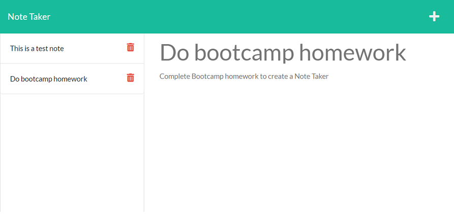

# Note Taker

## Description

This application uses Express.js as a server framework (part of Node.js) to build a Note Taker application.  The application allows user input to enter a note title and text.  The data is then saved to a file system.  The user can then add additional notes, or delete notes that have already been created.  The application uses modular routes for both the html files and the api's.   

The application is hosted on Heroku.

## Table of Contents

- [Screenshots and Links](#screenshots)
- [Acceptance Criteria](#acceptance)
- [What I Learned](#learned)
- [Credits](#credits)

## ScreenShots

Below is a screenshot of the application with some sample notes filled out.

The application is hosted on [Heroku](https://warm-sands-90457.herokuapp.com/)

The code is in the [GitHub Repository](https://github.com/stephencurrie/note-taker)

## Acceptance

The following were the acceptance criteria for the project:

- [x] When I open Note Taker, I am presented with a landing page with a link to a notes page
- [x] When I click on the link to the notes page, I am presented with a page with existing notes listed in the left-hand column, plus empty fields to enter a new note title and the note’s text in the right-hand column
- [x] When I enter a new note title and the note’s text, a Save icon appears in the navigation at the top of the page
- [x] When I click on the Save icon, the new note I have entered is saved and appears in the left-hand column with the other existing notes
- [x] When I click on an existing note in the list in the left-hand column, that note appears in the right-hand column
- [x] When I click on the Write icon in the navigation at the top of the page, I am presented with empty fields to enter a new note title and the note’s text in the right-hand column
- [x] When I click on the Delete icon, that note is deleted

## Learned

The following is a list of things I learned:

- How to use Express to build out a full-fledge server
- How to use routes to make get, post and delete calls to the server
- How to modularize those routes and put them into different files
- How to use Read and Append to get data from the server and update files to show the user
- How to use Heroku to host applications

## Credits
I want to thank our instructor Trey Eckels as he provided some sample code and additional help in completing the application.

I want to thank Simon Rennocks, my tutor, who also helped with some of the code bug fixes.